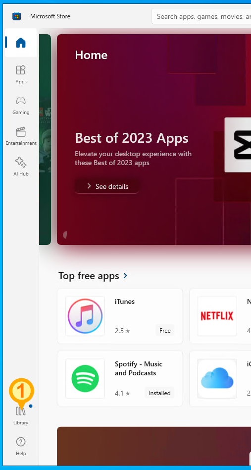
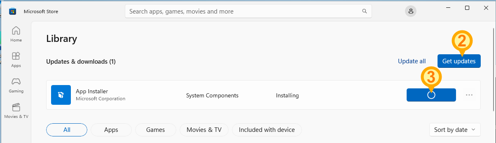
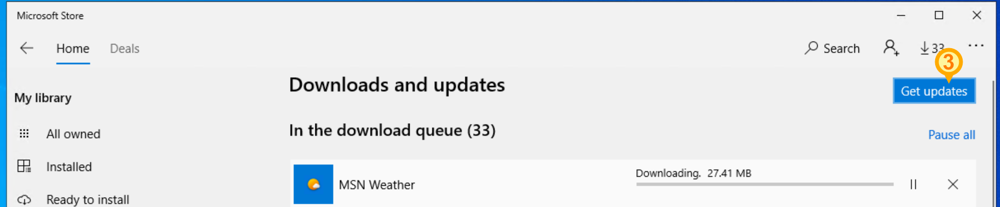

# DSI Course Pre-requisites
This repository contains instructions and scripts to get your computer setup for the Data Science Institute certificate programs.

## Computer requirements
Course-work for the certificate program is not computationally intensive and most desktop or laptop computers running a supported version of Windows, Linux, or macOS will suffice.
  - Windows 10 22H2 or later
  - Windows 11 21H2 or later
  - macOS 12 or later

Please ensure your operating system is up-to-date on maintenance and security updates.

**Note**: This course *cannot* be completed on an iPad or Android tablet.

## Software requirements
For all operating systems, your DSI courses will require the following software:
- Bash
- Git (command-line interface)
- Visual Studio Code
- The Miniconda Python distribution (or the full Anaconda distribution)

Setup instructions for each operating system are below.

## Windows
### Automated installation
This script will check whether course pre-requisites are installed and will install them if not found.

1. Ensure the App Installer is up-to-date in the Microsoft Store (see below)
1. Open Powershell
    - Click the Start Menu, and type "Powershell"
2. Copy the following code, and paste it into Powershell
    - *Note:* The paste function is the right-click button on your mouse (Powershell), or Ctrl+Shift+V (Windows Terminal).
3. Press Enter to run.

```powershell
Invoke-WebRequest https://github.com/UofT-DSI/Onboarding/raw/main/environment_setup/autoinstall_windows.ps1 -out autoinstall_windows.ps1
.\autoinstall_windows.ps1

```

### Manual installation
1. [Git](https://git-scm.com/download/win)
    1. *Note:* Git for Windows includes Bash
1. [Visual Studio Code](https://code.visualstudio.com/download)
    1. [Python extension](https://marketplace.visualstudio.com/items?itemName=ms-python.python)
    1. [Jupyter extension](https://marketplace.visualstudio.com/items?itemName=ms-toolsai.jupyter)
1. [The Miniconda Python distribution](https://docs.conda.io/projects/miniconda/en/latest/)
    1. Then, install the required packages by running `pip install numpy pandas matplotlib seaborn scikit-learn jupyter pyyaml plotly` in your Anaconda environment
1. *(Optional, but highly recommended)* [Windows Terminal](https://apps.microsoft.com/detail/9N0DX20HK701?hl=en-US&gl=US)
    1. Add Git Bash to your Windows Terminal profiles by running this [helper script](misc_gitbash_wt.ps1) in Powershell


## Linux or macOS

### Automated installation
Copy and paste the following code into your terminal:  
`$ curl -L https://github.com/UofT-DSI/Onboarding/raw/main/environment_setup/autoinstall_unix.sh | bash`

### Manual installation
*TODO*


## Testing your system

### Bash
1. Open bash in the Terminal
  * Windows: Open "Terminal" and find "Git Bash" from the New Tab menu
  * MacOS: Open "Terminal" and type `bash` at the prompt and press Enter

1. Type `pwd`
  [ ] Check that your current path appears
     * Windows: /c/Users/yourusername
     * MacOS: /home/yourusername

### Git
Follow these steps in your bash terminal:

1. Type `git --version`
  [ ] Check that your Git version is 2.34.0 or newer

1. Type `git-credential-manager github login`
  * Follow the prompts to login to GitHub

1. Type `git-credential-manager github list`
  [ ] You should see your GitHub username displayed

### VS Code & Python
1. Launch Visual Studio Code
1. Click File > New
1. Create a Python Notebook


## Updating App Installer on Windows
If you are using an up-to-date and supported version of Windows, but don't have winget, try updating your apps in the Microsoft Store.
- The App Installer component and Microsoft Store app must be updated to use the automatic installation script.

Open the Microsoft store by:
1. Opening the Start menu
2. Typing "store"
3. Clicking on "App Store" or "Microsoft Store"

After updating, you may need to reboot your computer and try running the automatic installation script again.

#### On Windows 11



#### On Windows 10


