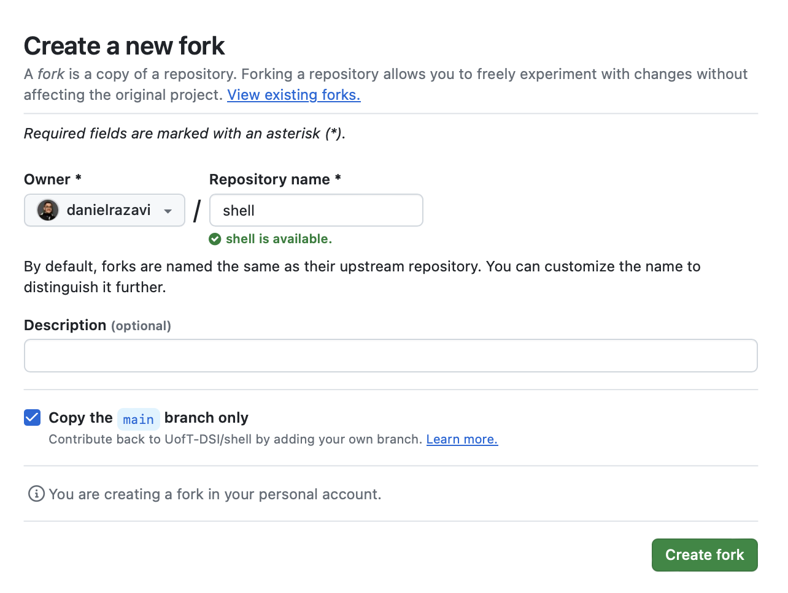
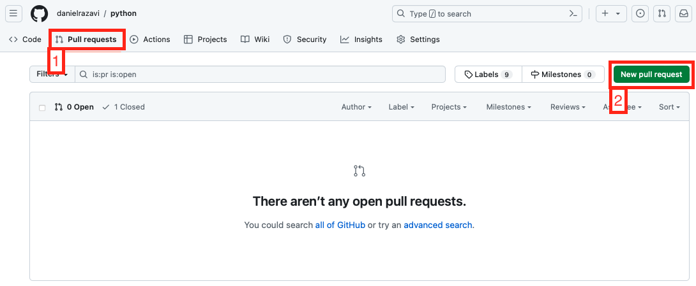

# Assignment Submission Guide

## Introduction

This guide is designed to standardize the submission and evaluation process for the learning modules in the DSI certificates. Our aim is to streamline the process using GitHub, ensuring consistency across modules. Submissions will primarily be in Python, SQL, or Markdown formats, with rare exceptions based on specific module requirements. 

## Setting Up

1. **Forking the Module Repository:** At the beginning of the module, participants will have to fork the module repository to their GitHub account. This is your personal workspace for the duration of the course.
    - Visit the designated UofT-DSI module repo.
    - Click "fork" on the page:
        
    - Please do **NOT** change the repo name presented in the "Create a new fork" page, simply click "Create Fork".
        
    - After a successful forking, your repo should be created at an address resembling `https://github.com/<YOUR GITHUB ID>/<LEARNING MODULE>`

*Note: For a visual guide on how to fork your repo, we've also created a video tutorial, ["How to Fork a Repo"](https://youtu.be/H-8kzcQWJ7U), available for you to watch.*

## Submitting Assignments

2. **Creating a Branch for the Assignment:** For each assignment, you must create a new branch named after the assignment, e.g., `assignment-1`. Note that we will be using dashes between words, and all lowercase. This branch should stem from your fork of the main module repository.
    
    
    

3. **Completing Your Assignment:** Work on your assignment within this branch. Ensure your submission includes all required files, following the formats specified.

4. **Creating a Pull Request (PR):**
    - Upon completing your assignment, create a pull request from your assignment branch (`assignment-1`) to **your fork's main branch**. (Please make sure the pull request is **NOT** to the source/upstream repository's main branch)
        
        
        
    - **PR Description:** Your pull request must include a detailed description of what you aimed to accomplish, the approach taken, and whether it has been tested. Please read [Guidelines for Pull Request Descriptions](#guidelines-for-pull-request-descriptions).
    - **Public Repository:** Ensure that your repository is public and accessible to others. If your repository is private, technical facilitators and learning support staff will not be able to access it and therefore will not be able to evaluate your submissions. To do this, go to your repository and check for the "public" badge next to the repository name.
        
    - **PR Link:** Please visit your pull request on another browser or in your browsers private mode to ensure that it is accessible by everyone. [Example Pull Request Submission Link](#example-pull-request-submission-link).
    - **Do not tag your teaching team in the pull request**: We will be able to find your submissions if you have followed the instructions above!
    

## Guidelines for Pull Request Descriptions

Your pull request needs to include the following:
- Summarize your implemented solution and any challenges faced.
- Detail the testing methods applied.
- Highlight any specific areas you'd like feedback on.

Please use the following template for your pull request descriptions:

    TITLE: UofT-DSI | <Module Name> - Assignment <assignment number>
   
    ## What changes are you trying to make? (e.g. Adding or removing code, refactoring existing code, adding reports)

    ## What did you learn from the changes you have made?

    ## Was there another approach you were thinking about making? If so, what approach(es) were you thinking of?

    ## Were there any challenges? If so, what issue(s) did you face? How did you overcome it?

    ## How were these changes tested?

    ## A reference to a related issue in your repository (if applicable)

    ## Checklist
    - [ ] I can confirm that my changes are working as intended

- For the most up to date template, please reference [pull_request_template.md](https://github.com/UofT-DSI/.github/blob/main/pull_request_template.md?plain=1)

## Example Pull Request Submission Link
A pull request link is typical comprised of the following structure: `https://github.com/<github_username>/<repo_name>/pull/<pr_id>`

For example:
    ```
    https://github.com/johnsmith/python/pull/2
    ```

*Note: For a visual guide on how to submit your assignments, we've also created a video tutorial, ["How to Submit an Assignment"](https://youtu.be/gXtxb0ECs2A), available for you to watch.*

## Handling Accidental Merges

Sometimes, you might accidentally merge your assignment branch into your fork's main branch before it's time to do so. If this happens, it's important to know how to reverse the changes to maintain the integrity of your main branch. Follow these steps to undo an accidental merge:

### Steps to Revert a Merge

1. **Identify the Merge Commit:**
    - Go to your repository's pull requests.
        
    - Click on "closed" to view a list of closed pull requests.
        
    - Find the pull request where the merge occurred.
        
    - Click on the pull request to open its details.
2. **Revert the Merge Commit:**
    - Click on the "Revert" button. This will create a new commit that undoes the changes made by the merge.
        
    - Follow the prompts to create a new pull request for the revert commit. Ensure this pull request is against your fork's main branch.
        

3. **Review and Merge the Revert Pull Request:**
    - Carefully review the changes in the revert pull request to ensure it only undoes the merge.
    - Once confirmed, merge the revert pull request into your main branch. This will restore your main branch to its state before the accidental merge.

4. **Clean Up Your Branches:**
    - If necessary, recreate the assignment branch from the main branch to continue working on your assignment.
    - Ensure any new changes are committed to the correct branch.

### Need Further Help?

If you encounter difficulties or need clarification on the steps, don't hesitate to reach out to the technical facilitators or learning support staff. They are here to help you navigate any issues you might encounter during your coursework.

## Resources

* [How to Fork a Repo](https://youtu.be/H-8kzcQWJ7U)
* [How to Submit an Assignment](https://youtu.be/gXtxb0ECs2A)
