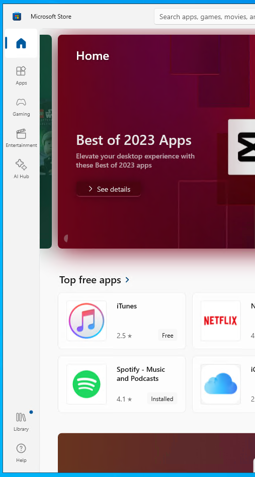
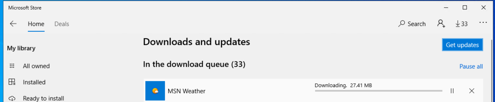

# Git Installation Scripts

This repository contains two scripts for checking and installing Git on your system: one for Unix-like systems (Bash script) and one for Windows (Batch script). Additionally, there's a tutorial script for learning Git basics.

## Contents
- `linux_mac_autoinstall.sh`: Bash script for Unix-like systems (Linux, macOS).
- `windows_autoinstall.bat`: Batch script for Windows.
- `git_tutorial.sh`: Tutorial script for learning Git.

## Windows

### Supported operating systems
- An up-to-date and supported version of Windows
  - Windows 10 22H2 or later
  - Windows 11 21H2 or later

### Course pre-requisite software
- Git for Windows
- Visual Studio Code
- The Anaconda Python distribution
- Optional: Windows Terminal

### Installing course pre-requisites
This script will install all course pre-requisites automatically.

1. Open Powershell
    - Click the Start Menu, and type "Powershell"
2. Copy the following code, and paste it into Powershell.
3. Press Enter to run.

```powershell
wget https://raw.githubusercontent.com/dtxe/DSI-Onboarding/windows_onboarding/scripts/windows_autoinstall.ps1 -out windows_autoinstall.ps1
.\windows_autoinstall.ps1
```


## Linux or macOS

### Prerequisites
- A Unix-like operating system (Linux or macOS).
- Terminal access.

### Usage
`$ curl https://raw.githubusercontent.com/dtxe/DSI-Onboarding/windows_onboarding/scripts/linux_mac_autoinstall.sh | bash`


## Setting Up and Using the Git Tutorial Script

### Prerequisites
- A Unix-like operating system (Linux or macOS).
- Terminal access.
- `git_tutorial.sh` script.

### Steps
1. **Create a New Folder**:
Create a new folder named `testGitRepo`.

```
mkdir testGitRepo
```


2. **Move the Script**:
Move `git_tutorial.sh` into the `testGitRepo` folder.

```
mv /path/to/git_tutorial.sh /path/to/testGitRepo/
```


3. **Navigate to the Folder**:
Change your directory to `testGitRepo`.

```
cd /path/to/testGitRepo
```


4. **Set Script Permissions**:
Make `git_tutorial.sh` executable.

```
chmod +x git_tutorial.sh
```


5. **Run the Tutorial Script**:
Start the tutorial by executing the script.

```
./git_tutorial.sh
```


## Note
- The Bash script identifies your operating system and attempts to install Git if it's not already installed.
- The Batch script checks if Git is installed on Windows and provides a download link if it's not.


## Windows Troubleshooting
### Error: winget is not available
If you are using an up-to-date and supported version of Windows, but don't have winget, try updating your apps in the Microsoft Store.
- The App Installer component must be updated through the store to use the automatic installation script.


#### On Windows 11


#### On Windows 10


